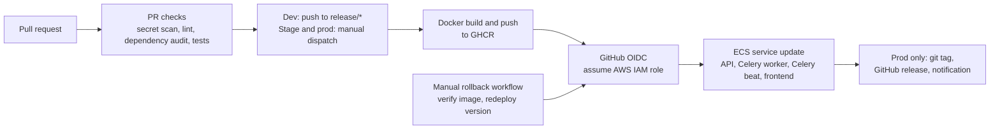

# Production CI/CD pipeline: GitHub Actions to AWS ECS

A sanitised extract of the CI/CD pipeline of a production web application: GitHub Actions workflows, Dockerfiles and dependency/secret-scanning configuration. Application source, history, environment files and all real identifiers have been removed. The workflows are the deployed ones with different names, so they will not run on their own.

## Stack

| Layer | Technology |
| --- | --- |
| Backend | Python 3.12, Django, served by Daphne (ASGI); Celery worker and Celery beat from the same image |
| Frontend | Next.js (Node 22), built as a standalone server |
| CI/CD | GitHub Actions on a third-party hosted runner (`ubicloud-standard-4`) |
| Registry | GitHub Container Registry (GHCR) |
| Deployment target | AWS ECS (services updated with `donaldpiret/ecs-deploy`); AWS Amplify for the development frontend |
| AWS authentication | GitHub OIDC with an assumed IAM role |

The backend is Python rather than Node.js. The pipeline shape (build, push, update ECS services, roll back by version) does not depend on the language.

## Architecture



Runtime pieces evidenced by the files: four ECS services per environment (API, Celery worker, Celery beat, frontend), one ECS cluster per environment, and Amplify for the development frontend.

## Pipeline stages

| Stage | Trigger | What it does | File |
| --- | --- | --- | --- |
| Backend PR checks | Pull request | Secret scan on the PR commit range, `uv.lock` drift check, ruff lint and format, dependency audit with a pinned `pip-audit` and an explicit ignore list | `.github/workflows/CI-Backend.yml` |
| Backend tests | PR and push to dev, staging, main; manual | `pytest -n auto` against a Postgres service container | `.github/workflows/backend-pytests.yml` |
| Frontend PR checks | Pull request | Secret scan, eslint, prettier, type-check, vitest | `.github/workflows/CI-Frontend.yml` |
| Security scan | Pull request | Calls a reusable workflow from the organisation's shared workflow repository (not included here) | `.github/workflows/pr-security-scan.yml` |
| Dev deploy | Push to `release/*`; manual | Path-filtered build of the backend image, frontend build and Amplify release, ECS update for API, worker and beat | `.github/workflows/new-dev-cicd.yml` |
| Stage deploy | Manual | Build backend and frontend images, ECS update for four services | `.github/workflows/new-stg-cicd.yml` |
| Prod deploy | Manual, with a `vX.Y` version input | Resolve version, path-filter against the previous release tag, build and push images, ECS update, then create the git tag and GitHub release | `.github/workflows/prod-cicd.yml` |
| Prod rollback | Manual, with a version and a service selection | Verify the target images exist in GHCR, then redeploy that version | `.github/workflows/rollback-prod.yml` |
| Dependency updates | Weekly | Dependabot for uv, npm and GitHub Actions | `.github/dependabot.yml` |

## Environments and promotion

- **Dev** deploys automatically on a push to a `release/*` branch, or manually.
- **Stage** and **prod** deploy only by manual dispatch. There is no automatic promotion between environments; each environment is deployed by running its own workflow.
- Prod requires a version in `vX.Y` form (`prod-cicd.yml`, `resolve-version` job). A new version deploys the dispatched commit and is tagged after a successful deploy. An existing version re-deploys that tag.
- Most jobs reference GitHub environments (`dev`, `stg`, `prod`). Approval rules and protection settings live in the repository settings and are not part of these files.
- Prod deploys and rollbacks share one concurrency group (`prod-deploy`) with cancellation disabled, so they queue rather than overlap.

## AWS authentication and permissions

Workflows declare `id-token: write` and use `aws-actions/configure-aws-credentials` with `role-to-assume` read from repository or environment variables. No AWS access keys appear in any workflow. The IAM role definitions and policies are not part of this extract.

## Secrets and configuration

Workflows read secrets and variables from GitHub (`secrets.*`, `vars.*`). Two secrets are passed to the frontend image build as BuildKit secrets rather than build arguments (`frontend-2/Dockerfile`, `--mount=type=secret`; the `secrets:` block in `prod-cicd.yml`). Public frontend configuration is passed as build arguments. How runtime configuration reaches the ECS tasks is defined outside these files.

## Container build

- **Backend** (`backend/Dockerfile`): multi-stage build on `python:3.12-slim`, a pinned `uv` version, apt and uv cache mounts, dependencies installed from the lock file with `--frozen --no-dev`, and only the virtualenv copied into the runtime stage.
- **Frontend** (`frontend-2/Dockerfile`): multi-stage build on Node 22 Alpine; the runtime stage carries only the Next.js standalone output and static assets.
- **Tags**: prod images are tagged with both the release version and the commit SHA; dev and stage images are tagged with the commit SHA. Each environment pushes to its own GHCR image name.
- **Cache**: prod and dev backend builds use the GitHub Actions layer cache (`cache-from: type=gha`).
- `backend/.dockerignore` excludes local environment files from the build context.

## Testing and quality gates

Backend: secret scan, lock-file consistency, ruff, `pip-audit`, pytest. Frontend: secret scan, eslint, prettier, type-check, vitest. CI workflows use a concurrency group per ref that cancels superseded runs. `.gitleaks.toml` extends the default gitleaks rules. These checks run on pull requests; the deploy workflows do not re-run them.

## Deployment, health checks and rollback

- Each ECS deploy step uses `donaldpiret/ecs-deploy` with `rollback: true` and a timeout (300 s for stage and prod, 900 s for dev).
- Prod creates the git tag and release only if every deploy job succeeded.
- Manual rollback is a separate workflow: it checks that the images for the requested version exist, then redeploys that version for all services, backend only or frontend only.
- The files do not define ECS health checks or load balancer configuration.

## Logging and monitoring

Prod and rollback workflows can post a notification to a chat webhook when `SLACK_DEPLOY_ENABLED` is `true`. The dev Amplify deploy job polls the Amplify job status every 10 seconds and fails the workflow on a failed or cancelled build. Application-level monitoring and AWS logging are not defined in these files.

## Repository layout

```
.github/
  dependabot.yml
  workflows/        CI, deploy and rollback workflows
.gitleaks.toml
backend/            Dockerfile, .dockerignore
frontend-2/         Dockerfile, .npmrc
docs/
  workflows.md                      Jobs, triggers, change detection, image tags
  deploy-rollback-troubleshooting.md  How to deploy, roll back and read failures
  configuration.md                  Secrets and variables the workflows read (names only)
```

## What was changed for publication

- Organisation, product, ECS cluster and service names, and the Amplify app ID were replaced with placeholders.
- References to an internal issue tracker (URLs, token name, ticket prefix) were replaced with a generic tracker.
- A reference to the organisation's shared workflow repository was replaced with a placeholder.
- A step that wrote an application credentials file into the build context, and the Dockerfile line that copied it, were removed as specific to a third-party integration.
- History-specific entries were removed from the gitleaks allowlist.
- Application source, migrations, environment files and git history were not copied.

## Not covered by these files

Infrastructure as code, task definitions, networking, load balancer, IAM policies, container image vulnerability scanning, alerting and the approval rules on the GitHub environments are not part of this extract.
